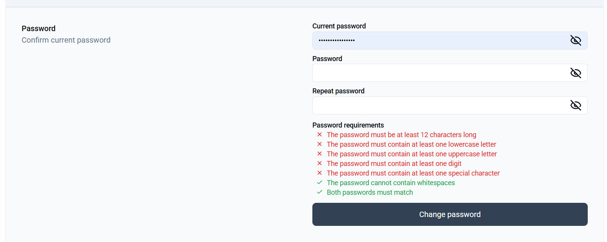

# Verduidelijking

Van een reactive form een template-driven form gemaakt

De basic input component is aangepast om overbodige code te verwijderen en om wachtwoorden te kunnen opmerken.
In de profile component is de mogelijkheid om de gebruikersnaam en het invoerveld van huidig wachtwoord verwijderd
De validator voor het wachtwoord is in een aparte directive gezet.
In de password form component wordt gebruik gemaakt van de input component, verdere code dat overbodig werd verwijderd.
De create en update componenten zijn aangepast om hun functionaliteiten te behouden.

# Visuele veranderingen




# Veranderingen in code bekijken

Bekijk commentaar voor verwijderde/aangepaste code
Zoek op volgende om toegevoegde code te bekijken:
- // Added
- ```html <!-- Added --> ```
